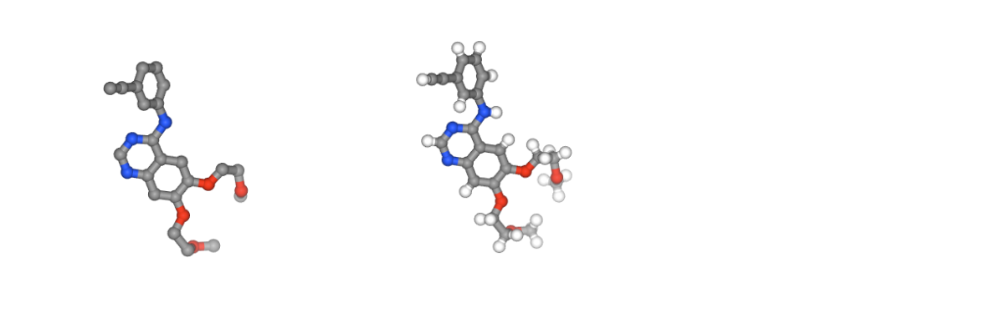

# Classical Molecular Interaction Potentials tutorial using BioExcel Building Blocks (biobb)

***
This tutorial aims to illustrate the process of computing **classical molecular interaction potentials** from **protein structures**, step by step, using the **BioExcel Building Blocks library (biobb)**. Examples shown are **Molecular Interaction Potentials (MIPs) grids, protein-protein/ligand interaction potentials, and protein titration**. The particular structures used are the **Lysozyme** protein (PDB code [1AKI](https://www.rcsb.org/structure/1aki), [https://doi.org/10.2210/pdb1AKI/pdb](https://doi.org/10.2210/pdb1AKI/pdb)), the **Epidermal Growth Factor Receptor** kinase domain (PDB code [4HJO](https://www.rcsb.org/structure/4HJO), [https://doi.org/10.2210/pdb4HJO/pdb](https://doi.org/10.2210/pdb4HJO/pdb)) complexed with the **Erlotinib** inhibitor (PDB code [AQ4](https://www.rcsb.org/ligand/AQ4), DrugBank Ligand Code [DB00530](https://go.drugbank.com/drugs/DB00530)),  and a MD simulation of the complex formed by the **SARS-CoV-2 Receptor Binding Domain and the human Angiotensin Converting Enzyme 2** (PDB code [6VW1](https://www.rcsb.org/structure/6vw1), [https://doi.org/10.2210/pdb6VW1/pdb](https://doi.org/10.2210/pdb6VW1/pdb)). 

The code wrapped is the ***Classical Molecular Interaction Potentials ([CMIP](https://anaconda.org/bioconda/cmip))*** code:

**Classical molecular interaction potentials: Improved setup procedure in molecular dynamics simulations of proteins.**
*Gelpí, J.L., Kalko, S.G., Barril, X., Cirera, J., de la Cruz, X., Luque, F.J. and Orozco, M. (2001)*
*Proteins, 45: 428-437. https://doi.org/10.1002/prot.1159*
***

## Settings

### Biobb modules used

 - [biobb_io](https://github.com/bioexcel/biobb_io): Tools to fetch biomolecular data from public databases.
 - [biobb_cmip](https://github.com/bioexcel/biobb_cmip): Tools to compute classical molecular interaction potentials from protein structures.
 - [biobb_structure_utils](https://github.com/bioexcel/biobb_structure_utils): Tools to modify or extract information from a PDB structure.
 - [biobb_chemistry](https://github.com/bioexcel/biobb_chemistry): Tools to perform chemoinformatics on molecular structures.
 - [biobb_amber](https://github.com/bioexcel/biobb_amber): Tools to setup and simulate atomistic MD simulations using AMBER MD package.
  
### Auxiliar libraries used

* [jupyter](https://jupyter.org/): Free software, open standards, and web services for interactive computing across all programming languages.
* [nglview](http://nglviewer.org/#nglview): Jupyter/IPython widget to interactively view molecular structures and trajectories in notebooks.
* [plotly](https://plot.ly/python/offline/): Python interactive graphing library integrated in Jupyter notebooks.
* [simpletraj](https://github.com/arose/simpletraj): Lightweight coordinate-only trajectory reader based on code from GROMACS, MDAnalysis and VMD.

### Conda Installation and Launch

```console
git clone https://github.com/bioexcel/biobb_wf_cmip.git
cd biobb_wf_cmip
conda env create -f conda_env/environment.yml
conda activate biobb_CMIP_tutorial
jupyter-notebook biobb_wf_cmip/notebooks/biobb_wf_cmip.ipynb
```

***
## Pipeline steps
 1. [Input Parameters](#input)
 2. [Fetching PDB structure](#fetch)
 3. [CMIP PDB preparation (from PDB structure)](#preparePDB)
 4. [Structural water molecules & ions](#titration)
 5. [Molecular Interaction Potentials](#mips)
    1. [Positive MIP (MIP+)](#mip_pos) 
    2. [Negative MIP (MIP-)](#mip_neg) 
    3. [Neutral MIP (MIPn)](#mip_neutral) 
 6. [Interaction Potential Energies](#interaction)
     1. [Protein-Ligand Interaction Energies](#prot-lig) 
        1. [Fetching PDB structure](#fetch2) 
        2. [Removing water molecules](#delWater)
        3. [Creating ligand topology](#ligandTop)
        4. [Generating system topology](#systemTop)
        5. [Minimizing the energy of the system](#minSystem)
        6. [Preparing the structures for CMIP](#prepProtLigCMIP)
        7. [Computing the Protein-Ligand interaction energies](#cmip_protein_ligand)
     2. [Protein-Protein Interaction Energies](#prot-prot)
        1. [CMIP PDB preparation (from MD)](#preparePDB_MD)
        2. [CMIP Boxes](#cmip_boxes)
        3. [RDB Interaction Potential Energies](#RBDinteraction)
        4. [hACE2 Interaction Potential Energies](#hACE2interaction)
 8. [Questions & Comments](#questions)
 
***

***

<a id="input"></a>
## Input parameters
**Input parameters** needed:
 - **pdbCode**: PDB code of the protein structure (e.g. 1AKI, [https://doi.org/10.2210/pdb1AKI/pdb](https://doi.org/10.2210/pdb1AKI/pdb))
 - **complexCode**: PDB code of the protein-ligand complex (e.g. 4HJO [*EGFR + Erlotinib*], [https://doi.org/10.2210/pdb4HJO/pdb](https://doi.org/10.2210/pdb4HJO/pdb)) 
 - **ligandCode**: PDB code of the ligand (e.g. AQ4 [*Erlotinib*], DrugBank Ligand Code [DB00530](https://go.drugbank.com/drugs/DB00530))
 - **mol_charge**: Charge of the small molecule
 - **MDCode**: Code of the Molecular Dynamics trajectory (e.g. RBD-hACE2)
     - **inputPDB_MD**: MD reference structure (PDB format)
     - **inputTOP_MD**: MD topology (Amber Parmtop7 format)


```python
import nglview
import ipywidgets
import plotly
from plotly import subplots
import plotly.graph_objs as go

pdbCode = "1aki"       # Structure of the orthorhombic form of Hen Egg-white Lysozyme
complexCode = "4hjo"   # Crystal structure of the inactive EGFR tyrosine kinase domain with erlotinib
ligandCode = "AQ4"     # Erlotinib epidermal growth factor receptor (EGFR) tyrosine kinase inhibitor
mol_charge = 0         # Molecular charge for Erlotinib

MDCode = "RBD-hACE2-ZN" 
inputPDB_MD = "Files/" + MDCode + ".pdb" # Structure of the SARS-CoV-2 RBD-hACE2 complex
inputTOP_MD = "Files/" + MDCode + ".top" # MD Topology of the SARS-CoV-2 RBD-hACE2 complex
```

<a id="fetch"></a>
***
## Fetching PDB structure
Downloading **PDB structure** with the **protein molecule** from the RCSB PDB database.<br>
Alternatively, a **PDB file** can be used as starting structure. <br>
***
**Building Blocks** used:
 - [Pdb](https://biobb-io.readthedocs.io/en/latest/api.html#module-api.pdb) from **biobb_io.api.pdb**
***


```python
# Downloading desired PDB file 
# Import module
from biobb_io.api.pdb import pdb

# Create properties dict and inputs/outputs
downloaded_pdb = pdbCode+'.pdb'
prop = {
    'pdb_code': pdbCode,
    'api_id' : 'mmb'
}

#Create and launch bb
pdb(output_pdb_path=downloaded_pdb,
    properties=prop)
```

<a id="vis3D"></a>
### Visualizing 3D structure
Visualizing the downloaded/given **PDB structure** using **NGL**: 


```python
# Show protein
view = nglview.show_structure_file(downloaded_pdb)
view.add_representation(repr_type='ball+stick', selection='all')
view._remote_call('setSize', target='Widget', args=['','600px'])
view
```

</img>

<a id="preparePDB"></a>
***
## CMIP PDB Preparation (from PDB structure)
**CMIP** tool needs additional information (e.g. charges, elements) to be included in the **structure PDB file** to properly run. A specific **BioBB building block** (prepare_pdb) is used in the next cell to prepare the **input PDB file**, adding this extra information. **Charges and elements** are taken from an internal **CMIP library** based on the **AMBER force fields**. 
***
**Building Blocks** used:
 - [cmip_prepare_pdb](https://biobb-cmip.readthedocs.io/en/latest/cmip.html#cmip-prepare-pdb-module) from **biobb_cmip.cmip.cmip_prepare_pdb**
***


```python
from biobb_cmip.cmip.cmip_prepare_pdb import cmip_prepare_pdb

cmipPDB = pdbCode + ".cmip.pdb"

cmip_prepare_pdb(input_pdb_path=downloaded_pdb,
            output_cmip_pdb_path=cmipPDB
)
```

<a id="titration"></a>
***
## Structural water molecules & ions
One of the many steps involved in the **MD structure setup process** is the addition of **solvent and counterions** (when working with explicit solvent). **Solvent molecules** and **counterions** are usually integrated on the **structure surface** in two steps:
- **Structural waters/ions**: A **first shell** of **water molecules and ions** is commonly added in the **energetically most favorable positions** on the surface of the structure. It is a computationally expensive process and is usually reduced to just tens of **water molecules** and **ions** (depending on the structure size).
- **Solvent box/ionic concentration**: A box of **solvent molecules** is created surrounding the original structure, and an additional number of **ions** are added until reaching a desired **ionic concentration**.

Whereas the second step is integrated in all the **MD packages**, the first one is rarely available. **CMIP** and the **biobb_titration building block** is helping in this task.   
***
**Building Blocks** used:
 - [cmip_titration](https://biobb-cmip.readthedocs.io/en/latest/cmip.html#cmip-titration-module) from **biobb_cmip.cmip.cmip_titration**
 - [cat_pdb](https://biobb-structure-utils.readthedocs.io/en/latest/utils.html#module-utils.cat_pdb) from **biobb_structure_utils.utils.cat_pdb**
***

<a id="run_titration"></a>
### Computing structural water molecules & ions positions
Computing the positions of **20 structural water molecules**, **5 positive** and **5 negative ions** in the most **energetically favourable** regions of the **structure surface**.


```python
from biobb_cmip.cmip.cmip_titration import cmip_titration

wat_ions_pdb = pdbCode + ".wat_ions.pdb"
wat_ions_log = pdbCode + ".wat_ions.log"

prop = { 
#    'neutral' : True, # Can be also used to neutralize the system
    'num_positive_ions' : 5,
    'num_negative_ions' : 5,    
    'num_wats' : 20
}

cmip_titration(input_pdb_path=cmipPDB,
          output_pdb_path=wat_ions_pdb,
          output_log_path=wat_ions_log,
          properties=prop)
```

<a id="catPDB_tit"></a>
### Adding structural water molecules & ions
Adding the 20 + 10 computed **structural water molecules** and **ions** to the original **PDB file**.


```python
from biobb_structure_utils.utils.cat_pdb import cat_pdb

titPDB = pdbCode + ".tit.pdb"

cat_pdb(input_structure1=cmipPDB,
       input_structure2=wat_ions_pdb,
       output_structure_path=titPDB)
```

<a id="visTIT"></a>
### Visualizing structural water molecules & ions
Visualizing the recently added **structural water molecules and ions**. 


```python
view = nglview.show_structure_file(titPDB)
view.clear_representations()
view.add_representation(repr_type='cartoon', selection='protein', color='sstruc')
view.add_representation(repr_type='spacefill', selection='water')
view.add_representation(repr_type='spacefill', selection='.Na', color='element')
view.add_representation(repr_type='spacefill', selection='.Cl', color='element')
view._remote_call('setSize', target='Widget', args=['','600px'])
view
```

</img>

<a id="mips"></a>
***
## Molecular Interaction Potentials (MIPs)
**Molecular interaction potentials (MIP)** are field properties arising from the interaction of a **probe** (e.g., methyl, proton or water) with a molecule. These are calculated in the surface of the molecule, with a grid defined around the structure.

**MIPs** are one of the most important molecular properties in the relationship between **molecular and binding data** (e.g. *3D Quantitative Structure-Activity Relationships, 3D-QSAR*), and is extensively applied in **drug discovery** processes.  

In this example, three different **MIPs** are used, with a **Water Oxygen atom** as a probe:
 - **Positive** MIP - highlighting the protein regions with **higher affinity** to **negatively charged groups**.
 - **Negative** MIP - highlighting the protein regions with **higher affinity** to **positively charged groups**.
 - **Neutral** MIP - highlighting the protein regions with **lower affinity** to **electrocharged groups**.
***
**Building Blocks** used:
 - [cmip](https://biobb-cmip.readthedocs.io/en/latest/cmip.html#module-cmip.cmip) from **biobb_cmip.cmip.cmip**
***

<a id="mip_pos"></a>
### Positive MIP


```python
from biobb_cmip.cmip.cmip_run import cmip_run

mip_pos_log = pdbCode + ".mip_pos.log"
mip_pos_cube = pdbCode + ".mip_pos.cube"

prop = { 
    'execution_type' : 'mip_pos'
}

cmip_run( input_pdb_path=cmipPDB,
          output_log_path=mip_pos_log,
          output_cube_path=mip_pos_cube,
          properties=prop)
```

<a id="visMIP1"></a>
### Visualizing 3D structure
Visualizing the **positive MIP grid**, with protein regions with **higher affinity** to **negatively charged groups** highlighted.


```python
view = nglview.show_structure_file(mip_pos_cube)
view.add_component(nglview.FileStructure(cmipPDB))
view.clear_representations()
view.add_representation(repr_type='cartoon', selection='protein', color='sstruc')
view.add_surface(isolevelType="value", isolevel=-5, color="blue")
view.component_1.center()
view._remote_call('setSize', target='Widget', args=['','600px'])
view
```

</img>

<a id="mip_neg"></a>
### Negative MIP


```python
from biobb_cmip.cmip.cmip_run import cmip_run

mip_neg_log = pdbCode + ".mip_neg.log"
mip_neg_cube = pdbCode + ".mip_neg.cube"

prop = { 
    'execution_type' : 'mip_neg'
}

cmip_run(input_pdb_path=cmipPDB,
          output_log_path=mip_neg_log,
          output_cube_path=mip_neg_cube,
          properties=prop)
```

<a id="visMIP2"></a>
### Visualizing 3D structure
Visualizing the **negative MIP grid**, with protein regions with **higher affinity** to **positively charged groups** highlighted.


```python
view = nglview.show_structure_file(mip_neg_cube)
view.add_component(nglview.FileStructure(cmipPDB))
view.clear_representations()
view.add_representation(repr_type='cartoon', selection='protein', color='sstruc')
view.add_surface(isolevelType="value", isolevel=-10, color="red")
view.component_1.center()
view._remote_call('setSize', target='Widget', args=['','600px'])
view
```

</img>

<a id="mip_neutral"></a>
### Neutral MIP


```python
from biobb_cmip.cmip.cmip_run import cmip_run

mip_neutral_log = pdbCode + ".mip_neutral.log"
mip_neutral_cube = pdbCode + ".mip_neutral.cube"

prop = { 
    'execution_type' : 'mip_neu'
}

cmip_run( input_pdb_path=cmipPDB,
          output_log_path=mip_neutral_log,
          output_cube_path=mip_neutral_cube,
          properties=prop)
```

<a id="visMIP3"></a>
### Visualizing 3D structure
Visualizing the **neutral MIP grid**, with protein regions with **lower affinity** to **electrocharged groups** highlighted.


```python
view = nglview.show_structure_file(mip_neutral_cube)
view.add_component(nglview.FileStructure(cmipPDB))
view.clear_representations()
view.add_representation(repr_type='cartoon', selection='protein', color='sstruc')
view.add_surface(isolevelType="value", isolevel=-1, color="grey")
view.component_1.center()
view._remote_call('setSize', target='Widget', args=['','600px'])
view
```

</img>

<a id="visMIP4"></a>
### Visualizing 3D structure
Visualizing all **MIP grids**, for comparison purposes.


```python
#Show different structures generated (for comparison)
view1 = nglview.show_structure_file(cmipPDB)
view1.add_component(nglview.FileStructure(mip_pos_cube))
view1.component_0.add_representation(repr_type='cartoon', selection='protein', color='sstruc')
view1.component_1.add_surface(isolevelType="value", isolevel=-5, color="blue")
view1.component_0.center()
view1._remote_call('setSize', target='Widget', args=['350px','400px'])
view1.camera='orthographic'
view1
view2 = nglview.show_structure_file(cmipPDB)
view2.add_component(nglview.FileStructure(mip_neg_cube))
view2.component_0.add_representation(repr_type='cartoon', selection='protein', color='sstruc')
view2.component_1.add_surface(isolevelType="value", isolevel=-10, color="red")
view2.component_0.center()
view2._remote_call('setSize', target='Widget', args=['350px','400px'])
view2.camera='orthographic'
view2
view3 = nglview.show_structure_file(cmipPDB)
view3.add_component(nglview.FileStructure(mip_neutral_cube))
view3.component_0.add_representation(repr_type='cartoon', selection='protein', color='sstruc')
view3.component_1.add_surface(isolevelType="value", isolevel=-1, color="grey")
view3.component_0.center()
view3._remote_call('setSize', target='Widget', args=['350px','400px'])
view3.camera='orthographic'
view3
ipywidgets.HBox([view1, view2, view3])
```

</img></img></img>

<a id="interaction"></a>
***
## Interaction Potential Energies 

Closely related to the previous study of **Molecular Interaction Potentials**, the **Interaction Potential Energies** calculation computes the contributions to the **total energy** of the system from the different **interactions between the subunits of the molecule** considered. These **interaction energies** usually depend on the relation between the **charge** and **positions** of the units studied (e.g. *electrostatic, van der Waals*) and the **solvation energy** (energy released when a compound is dissolved in a solvent).

**Interaction Potential Energies** give useful insights in the **macromolecular interaction** process, with the possibility to identify **key residues** involved in the interaction, and thus being another key component of the **drug discovery** process.  

To illustrate the calculation of the **interaction potentials** between two subunits of a **structure complex** (e.g. protein-protein, protein-ligand), two different examples are used:

- **Epidermal Growth Factor Receptor** kinase domain with **Erlotinib** inhibitor.
- **SARS-CoV-2 Receptor Binding Domain** with **human Angiotensin Converting Enzyme 2**. 

<a id="prot-lig"></a>
***
## Protein-Ligand Interaction Energies

This example illustrates the steps needed to compute the **protein-ligand interaction energies** from a **crystal structure** of the **complex** taken directly from the **PDB data bank**. The particular example used is the **Epidermal Growth Factor Receptor** kinase domain (PDB code [4HJO](https://www.rcsb.org/structure/4HJO, [https://doi.org/10.2210/pdb4HJO/pdb](https://doi.org/10.2210/pdb4HJO/pdb)) with **Erlotinib** inhibitor (PDB code [AQ4](https://www.rcsb.org/ligand/AQ4), DrugBank Ligand Code [DB00530](https://go.drugbank.com/drugs/DB00530)). 

To properly compute the **interaction energies**, the **protein-ligand** complex needs to be pre-processed, adding the (typically) missing **hydrogen atoms**, finding out the **atomic charges** and **elements**, and **relaxing** the structure to avoid **steric issues** due to **crystallographic packing**. All these steps are performed in the following cells using **BioBB building blocks**


<a id="fetch2"></a>
***
## Fetching PDB structure
Downloading **PDB structure** with the **protein molecule** from the RCSB PDB database.<br>
Alternatively, a **PDB file** can be used as starting structure. <br>
***
**Building Blocks** used:
 - [Pdb](https://biobb-io.readthedocs.io/en/latest/api.html#module-api.pdb) from **biobb_io.api.pdb**
***


```python
# Downloading desired PDB file 
# Import module
from biobb_io.api.pdb import pdb

# Create properties dict and inputs/outputs
downloaded_pdb = complexCode+'.pdb'
prop = {
    'pdb_code': complexCode,
    'api_id' : 'mmb',
    'filter': ['ATOM', 'HETATM'],
}

#Create and launch bb
pdb(output_pdb_path=downloaded_pdb,
    properties=prop)
```

<a id="vis3D"></a>
### Visualizing 3D structure
Visualizing the downloaded/given **PDB structure** using **NGL**: 


```python
# Show protein
view = nglview.show_structure_file(downloaded_pdb)
view.add_representation(repr_type='ball+stick', selection='hetero')
view._remote_call('setSize', target='Widget', args=['','600px'])
view
```

</img>

<a id="delWater"></a>
***
## Removing Water Molecules
Removing the **water molecules** from the **downloaded/given structure**.<br>

***
**Building Blocks** used:
 - [remove_pdb_water](https://biobb-structure-utils.readthedocs.io/en/latest/utils.html#module-utils.remove_pdb_water) from **biobb_structure_utils.utils**
***


```python
# Import module
from biobb_structure_utils.utils.remove_pdb_water import remove_pdb_water

# Removing Waters:

# Create properties dict and inputs/outputs
nohoh_pdb = complexCode+'.noHOH.pdb'

#Create and launch bb
remove_pdb_water(
    input_pdb_path=downloaded_pdb,
    output_pdb_path=nohoh_pdb
)
```

<a id="vis3D"></a>
### Visualizing 3D structure
Visualizing the **structure** without **water molecules** using **NGL**: 


```python
# Show protein
view = nglview.show_structure_file(nohoh_pdb)
view.add_representation(repr_type='ball+stick', selection='hetero')
view._remote_call('setSize', target='Widget', args=['','600px'])
view
```

</img>

<a id="ligandTop"></a>
***
## Creating Ligand Topology
Obtaining parameters for the **small molecule** to be used in the **potential energy** calculations.<br>

***
**Building Blocks** used:
 - [extract_heteroatoms](https://biobb-structure-utils.readthedocs.io/en/latest/utils.html#module-utils.extract_heteroatoms) from **biobb_structure_utils.utils**
 - [reduce_add_hydrogens](https://biobb-chemistry.readthedocs.io/en/latest/ambertools.html#module-ambertools.reduce_add_hydrogens) from **biobb_chemistry.ambertools**
 - [acpype_params_ac](https://biobb-chemistry.readthedocs.io/en/latest/acpype.html#module-acpype.acpype_params_ac) from **biobb_chemistry.acpype**
***

### Step 1: Extracting Ligand


```python
# Create Ligand system topology, STEP 1
# Extracting Ligand 
# Import module
from biobb_structure_utils.utils.extract_heteroatoms import extract_heteroatoms

# Create properties dict and inputs/outputs
ligandFile = ligandCode+'.pdb'

prop = {
     'heteroatoms' : [{"name": ligandCode}]
}

extract_heteroatoms(
    input_structure_path=nohoh_pdb,
    output_heteroatom_path=ligandFile,
    properties=prop
)
```

### Step 2: Add hydrogen atoms to the ligand

**NOTE**: Check the protonation state of the small molecule after this step. Tools to automatically add hydrogen atoms may not give the most appropriate protonation state.  


```python
# Create Ligand system topology, STEP 2
# Reduce_add_hydrogens: add Hydrogen atoms to a small molecule (using Reduce tool from Ambertools package)
# Import module
from biobb_chemistry.ambertools.reduce_add_hydrogens import reduce_add_hydrogens

# Create prop dict and inputs/outputs
output_reduce_h = ligandCode+'.reduce.H.pdb' 

# Create and launch bb
reduce_add_hydrogens(
    input_path=ligandFile,
    output_path=output_reduce_h
) 
```

### Step 3: Generating ligand topology 


```python
# Create Ligand system topology, STEP 3
# Acpype_params_gmx: Generation of topologies for AMBER with ACPype
# Import module
from biobb_chemistry.acpype.acpype_params_ac import acpype_params_ac

# Create prop dict and inputs/outputs
output_acpype_inpcrd = ligandCode+'params.inpcrd'
output_acpype_frcmod = ligandCode+'params.frcmod'
output_acpype_lib = ligandCode+'params.lib'
output_acpype_prmtop = ligandCode+'params.prmtop'
output_acpype = ligandCode+'params'

prop = {
    'basename' : output_acpype,
    'charge' : mol_charge
}

# Create and launch bb
acpype_params_ac(input_path=output_reduce_h, 
                output_path_inpcrd=output_acpype_inpcrd,
                output_path_frcmod=output_acpype_frcmod,
                output_path_lib=output_acpype_lib,
                output_path_prmtop=output_acpype_prmtop,
                 properties=prop)
```

### Visualizing 3D structures
Visualizing the **ligand** structures:

**Original ligand** PDB structure (left)
**Ligand** PDB structure with **hydrogen atoms** (right)


```python
# Show different structures generated (for comparison)
view1 = nglview.show_structure_file(ligandFile)
view1.add_representation(repr_type='ball+stick')
view1._remote_call('setSize', target='Widget', args=['400px','400px'])
view1.camera='orthographic'
view1
view2 = nglview.show_structure_file(output_reduce_h)
view2.add_representation(repr_type='ball+stick')
view2._remote_call('setSize', target='Widget', args=['400px','400px'])
view2.camera='orthographic'
view2
ipywidgets.HBox([view1, view2])
```

</img>

<a id="systemTop"></a>
***
## Generating system topology
Generating the **system topology** for the **protein-ligand complex** using **tleap** from the **AmberTools package**. The **topology** will then be used to extract the needed **parameters** (e.g. atom charges) for the **potential energy** calculation.<br>

***
**Building Blocks** used:
 - [leap_gen_top](https://biobb-amber.readthedocs.io/en/latest/leap.html#module-leap.leap_gen_top) from **biobb_amber.leap**
***


```python
# Import module
from biobb_amber.leap.leap_gen_top import leap_gen_top

# Create prop dict and inputs/outputs
output_pdb_path = 'structure.leap.pdb'
output_top_path = 'structure.leap.prmtop'
output_crd_path = 'structure.leap.crd'

prop = {
    "forcefield" : ["protein.ff14SB","gaff2"]
}

# Create and launch bb
leap_gen_top(input_pdb_path=nohoh_pdb,
           input_lib_path=output_acpype_lib,
           input_frcmod_path=output_acpype_frcmod,
           output_pdb_path=output_pdb_path,
           output_top_path=output_top_path,
           output_crd_path=output_crd_path,
           properties=prop)
```

<a id="minSystem"></a>
***
## Minimizing the energy of the system
Running a short **energetic minimization** to relax the system and remove **possible clashes** introduced by **crystallographic** constraints.<br>
                                                                                           
***
**Building Blocks** used:
 - [sander_mdrun](https://biobb-amber.readthedocs.io/en/latest/sander.html#module-sander.sander_mdrun) from **biobb_amber.sander**
 - [amber_to_pdb](https://biobb-amber.readthedocs.io/en/latest/ambpdb.html#module-ambpdb.amber_to_pdb) from **biobb_amber.ambpdb**
***


```python
from biobb_amber.sander.sander_mdrun import sander_mdrun

trj_amber = "structure.amber.crd"
rst_amber = "structure.amber.rst"
log_amber = "structure.amber.log"

prop = {
    'simulation_type' : 'minimization',
    'mdin' : {
        'ntb' : 0,        # Periodic Boundary. No periodicity is applied and PME (Particle Mesh Ewald) is off.
        'cut' : 12,       # Nonbonded cutoff, in Angstroms.
        'maxcyc' : 500,   # Maximum number of cycles of minimization.
        'ncyc' : 50,      # Minimization will be switched from steepest descent to conjugate gradient after ncyc cycles.
        'ntwx' : 50       # Trajectory output frequency
    }
}

sander_mdrun(
     input_top_path=output_top_path,
     input_crd_path=output_crd_path,
     output_traj_path=trj_amber,
     output_rst_path=rst_amber,
     output_log_path=log_amber,
     properties=prop
)
```

### Extracting a PDB file from the minimized system 


```python
from biobb_amber.ambpdb.amber_to_pdb import amber_to_pdb

pdb_amber_min = "structure.amber-min.pdb"

amber_to_pdb(
      input_top_path=output_top_path,
      input_crd_path=rst_amber,
      output_pdb_path=pdb_amber_min
)
```

<a id="prepProtLigCMIP"></a>
***
## Preparing the structures for CMIP
Preparing the structures for the **CMIP calculations**, using the energetically relaxed **PDB structure** coordinates and the information from the generated **topology**. Files needed are:

* **Protein-ligand Complex**: Protein-Ligand complex, with information needed by **CMIP** (charges, elements)
* **Protein isolated**: Structure of the protein in **apo state** (without the ligand)
* **Protein-ligand Complex** with protein structure in **dielectric mode** (charges neutralized); Atoms in **dielectric mode** are occupying a **volume** but charges are replaced by a **continuum dielectric**, important for the **interaction energy** calculation. These atoms are identified by **CMIP** with an "X" letter just before the element symbol in the input PDB file (automatically inserted by the *ignore_residues* building block)

***
**Building Blocks** used:
 - [cmip_prepare_structure](https://biobb-cmip.readthedocs.io/en/latest/cmip.html#module-cmip.prepare_structure) from **biobb_cmip.cmip.cmip_prepare_structure**
 - [remove_ligand](https://biobb-structure-utils.readthedocs.io/en/latest/utils.html#module-utils.remove_ligand) from **biobb_structure_utils.utils.remove_ligand**
 - [cmip_ignore_residues](https://biobb-cmip.readthedocs.io/en/latest/cmip.html#module-cmip.ignore_residues) from **biobb_cmip.cmip.cmip_ignore_residues**
***

### CMIP PDB structure Preparation 1

Creating the **Protein-Ligand Complex** PDB file from **PDB structure** and **AMBER topology**.


```python
from biobb_cmip.cmip.cmip_prepare_structure import cmip_prepare_structure

cmipPDB = complexCode + ".cmip.pdb"

cmip_prepare_structure(input_pdb_path=pdb_amber_min,
            input_topology_path=output_top_path,            
            output_cmip_pdb_path=cmipPDB
)
```

### CMIP PDB structure Preparation 2

Creating the **Protein isolated** PDB file from the previously generated **CMIP PDB structure**, removing the **ligand**.


```python
# Import module
from biobb_structure_utils.utils.remove_ligand import remove_ligand

# Create properties dict and inputs/outputs
cmipPDB_EGFR_Prot = complexCode+'.noLIG.pdb'

prop = {
    'ligand' : ligandCode
}

#Create and launch bb
remove_ligand(input_structure_path=cmipPDB,
    output_structure_path=cmipPDB_EGFR_Prot,
    properties=prop)
```

### CMIP PDB structure Preparation 3

Creating the **Protein-ligand Complex** with protein structure in **dielectric mode**. For this, all residues belonging to the **protein structure** (in this case, residues with id from 1 to 279) are marked with an 'X' symbol in the PDB. This is done by the *ignore_residues* building block.


```python
from biobb_cmip.cmip.cmip_ignore_residues import cmip_ignore_residues

cmipPDB_EGFR_Prot_ignored = complexCode + ".Prot_ignored.cmip.pdb"

protein_residues = list(range(1,279))
    
prop = {
    'residue_list': protein_residues # WARNING: Change residue number accordingly
}

cmip_ignore_residues(input_cmip_pdb_path = cmipPDB,
                     output_cmip_pdb_path = cmipPDB_EGFR_Prot_ignored,
                     properties = prop)
```

<a id="cmip_protein_ligand"></a>
***
## Computing the Protein-Ligand interaction energies

Computing the **Protein-Ligand interaction energies** using the complex with the protein in **dielectric mode** as a **CMIP host structure** and the **protein structure** as a **CMIP ligand** (probe). 

***
**Building Blocks** used:
 - [cmip](https://biobb-cmip.readthedocs.io/en/latest/cmip.html#module-cmip.cmip) from **biobb_cmip.cmip.cmip**
***


```python
from biobb_cmip.cmip.cmip_run import cmip_run

EGFR_energies_log = complexCode + ".EGFR.energies.log"
EGFR_byat_out = complexCode + ".EGFR.energies.byat.out"

prop = { 
    'execution_type' : 'pb_interaction_energy'
}

cmip_run(input_pdb_path=cmipPDB_EGFR_Prot_ignored,
         input_probe_pdb_path=cmipPDB_EGFR_Prot,
         output_log_path=EGFR_energies_log,
         output_byat_path=EGFR_byat_out,
         properties=prop)
```

<a id="cmip_protein_ligand_plot"></a>
***
### Plotting the Protein-Ligand interaction energies by atom

Plotting the **Protein-Ligand interaction energies** with the **protein atom id** in the x-axis and the **potential energies** in KCal/mol in the y-axis. An auxiliar function included in the **biobb_cmip** module is used to extract the energies by atom (*get_energies_byat*).

***


```python
import plotly
import plotly.graph_objs as go
from biobb_cmip.utils.representation import get_energies_byat

atom_list, energy_dict = get_energies_byat(EGFR_byat_out, cutoff=50)

plotly.offline.init_notebook_mode(connected=True)

fig = {"data": [go.Scatter(x=atom_list, y=energy_dict['ES&VDW'])],
       "layout": go.Layout(title="CMIP Interaction Potential", 
                           xaxis=dict(title = "Atom Number"), 
                           yaxis=dict(title = "Potential Energy Kcal/mol"))}

plotly.offline.iplot(fig)
```

</img>

<a id="cmip_protein_ligand_plot2"></a>
***
### Plotting the Protein-Ligand interaction energies by residue

Plotting the **Protein-Ligand interaction energies** with the **protein residue sequence** in the x-axis and the **potential energies** in KCal/mol in the y-axis. An auxiliar function included in the **biobb_cmip** module is used to extract the energies by residues (*get_energies_byres*).

***


```python
import plotly
import plotly.graph_objs as go
import re
from biobb_cmip.utils.representation import get_energies_byres


res_list, energy_dict = get_energies_byres(EGFR_byat_out, cutoff=55)

plotly.offline.init_notebook_mode(connected=True)

fig = {"data": [go.Scatter(x=res_list, y=energy_dict['ES&VDW'])],
       "layout": go.Layout(title="CMIP Interaction Potential", 
                           xaxis=dict(title = "Residue ID"), 
                           yaxis=dict(title = "Potential Energy Kcal/mol"))}

plotly.offline.iplot(fig)

energy_cutoff = -1.5
identified_residues = [res_list[energy_dict['ES&VDW'].index(item)] 
                       for item in energy_dict['ES&VDW'] if item < energy_cutoff]
identified_residues_ngl = str([int(re.sub(r'[A-Z]+ ', '', item)) for item in identified_residues]).replace(',','')

print ("Residues involved in the interaction (energy < " + str(energy_cutoff) + " KCal/mol):")
print (identified_residues_ngl)
```

</img>

<a id="cmip_protein_ligand_ngl"></a>
***
### Visualizing the Protein-Ligand interaction residues

Viewing the residues involved in the interaction with NGL. **Ligand** is represented in CPK, whereas **protein residues** are represented in Licorice. 

***


```python
# Show protein
view = nglview.show_structure_file(cmipPDB)
view.clear_representations()
view.add_representation(repr_type='cartoon', selection='all',color='sstruc',opacity=0.3)
view.add_representation(repr_type='ball+stick', selection=ligandCode)
view.add_representation(repr_type='licorice', selection=identified_residues_ngl)
view.center(ligandCode)
view._remote_call('setSize', target='Widget', args=['','600px'])
view
```

</img>

<a id="prot-prot"></a>
***
## Protein-Protein Interaction Energies

This example illustrates the steps needed to compute the **protein-protein interaction energies** from a **structure conformation** of the **complex** taken directly from a **Molecular Dynamics simulation**. The particular example used is the **SARS-CoV-2 Receptor Binding Domain (RBD)** complexed with the human **Angiotensin Converting Enzyme 2 (hACE2)** (PDB code [6VW1](https://www.rcsb.org/structure/6vw1), MD code [MCV1900410](https://bioexcel-cv19.bsc.es/#/id/MCV1900410/overview), [https://doi.org/10.2210/pdb6VW1/pdb](https://doi.org/10.2210/pdb6VW1/pdb)). 

<a id="visRBD-hACE2"></a>
### Visualizing 3D structure
Visualizing the original **SARS-CoV-2 Receptor Binding Domain** (blue chain) and the **human Angiotensin Converting Enzyme 2** (red chain) structure complex, taken from a **MD simulation trajectory**.


```python
view = nglview.show_structure_file(inputPDB_MD)
view.clear_representations()
view.add_representation(repr_type='cartoon', selection='protein', color='chainname')
view._remote_call('setSize', target='Widget', args=['','400px'])
view
```

</img>

<a id="preparePDB_MD"></a>
***
## CMIP PDB Preparation (from Molecular Dynamics topology)
When working with **structure conformations** taken from **MD simulations**, it is recommended to use the **charges, atom types and elements** considered in the simulation. Usually this information is stored in the so-called ***topology*** files. A specific **building block** (***prepare_structure***) is available to extract these information from an **MD topology file** and use it for the **CMIP calculations**.
 
The next cells are taking one frame of the **MD simulation**, splitting the subunits (chains) in two different **PDB files**, and preparing them to be used in **CMIP**, taking the **charges and elements** used in the simulations from the **MD topology file**. 
***
**Building Blocks** used:
 - [prepare_structure](https://biobb-cmip.readthedocs.io/en/latest/cmip.html#module-cmip.prepare_structure) from **biobb_cmip.cmip.prepare_structure** 
 - [extract_chain](https://biobb-structure-utils.readthedocs.io/en/latest/utils.html#module-utils.extract_chain) from **biobb_structure_utils.utils.extract_chain**
***

### Preparing structure
Preparing the structure for the **CMIP calculations**, using the original **MD topology file** information.


```python
from biobb_cmip.cmip.cmip_prepare_structure import cmip_prepare_structure

cmipPDB_MD = MDCode + ".cmip.pdb"

cmip_prepare_structure(input_pdb_path=inputPDB_MD,
                       input_topology_path=inputTOP_MD,
                       output_cmip_pdb_path=cmipPDB_MD)
```

### Extracting chains 
Saving **hACE2** (chain A) and **RBD** (chain B) in two different **PDB files**. 


```python
from biobb_structure_utils.utils.extract_chain import extract_chain

cmipPDB_MD_hACE2 = MDCode + ".hACE2.cmip.pdb"
cmipPDB_MD_RBD = MDCode + ".RBD.cmip.pdb"

prop = {
    'chains': [ 'A' ],
    'permissive' : True    
}
extract_chain(input_structure_path=cmipPDB_MD,
            output_structure_path=cmipPDB_MD_hACE2,
            properties=prop)

prop = {
    'chains': [ 'B' ],
    'permissive' : True
}
extract_chain(input_structure_path=cmipPDB_MD,
            output_structure_path=cmipPDB_MD_RBD,
            properties=prop)
```

### Visualizing structures
Visualizing the generated structures: **hACE2** and **RBD**.


```python
# Show different structures generated 
view1 = nglview.show_structure_file(cmipPDB_MD_hACE2)
view1.component_0.add_representation(repr_type='cartoon', selection='protein', color='sstruc')
view1.component_0.center()
view1._remote_call('setSize', target='Widget', args=['400px','400px'])
view1.camera='orthographic'
view1
view2 = nglview.show_structure_file(cmipPDB_MD_RBD)
view2.component_0.add_representation(repr_type='cartoon', selection='protein', color='sstruc')
view2.component_0.center()
view2._remote_call('setSize', target='Widget', args=['400px','400px'])
view2.camera='orthographic'
view2
ipywidgets.HBox([view1, view2])
```

</img>

<a id="cmip_boxes"></a>
***
## CMIP Boxes

**CMIP** computes **interaction energies** using **3D grids** (see image). **CMIP** tries to automatically built a **grid** enclosing the  structure under study, which is fine in most of the cases. However, when working with **protein-protein interactions**, the **grid** needs to be adjusted to the system. The next cells are computing and showing the **3D grids** needed to enclose the two **monomers** and the **complex**, and are useful to inspect them and re-define them, increasing the size, if needed.

A specific property of the **cmip building block** (*execution_type = check_only*) allows the calculation of the **3D grids**, and accepts params such as *perfill*, which specifies the **portion of the grid** filled by the input (host) structure or *box_size_factor*, which increases the **size of the grid**. The computed **grids** can be then used as an input for the final **interaction energies** calculations.

***
</img>
***
**Building Blocks** used:
 - [cmip_run](https://biobb-cmip.readthedocs.io/en/latest/cmip.html#module-cmip.cmip) from **biobb_cmip.cmip.cmip_run**
***

### Box (3D Grid) for the RBD
Computing and visualizing the **box** enclosing the **RBD monomer**. Applying a *perfill* factor of 0.8. 


```python
from biobb_cmip.cmip.cmip_run import cmip_run

cmip_RBD_box_log = "RBD.box.log"
cmip_RBD_box_out = "RBD.box.byat.out"
cmip_RBD_box_json = "RBD.box.json"

prop = { 
    'execution_type' : 'check_only',
    'params' : {
         'perfill' : 0.8
    }
}

cmip_run(input_pdb_path=cmipPDB_MD_RBD,
         output_log_path=cmip_RBD_box_log,
         output_json_box_path=cmip_RBD_box_json,
         properties=prop)
```

### Visualizing the RBD Box


```python
import nglview as nv
from biobb_cmip.utils.representation import create_box_representation

boxedFilename, atomPair = create_box_representation(cmip_RBD_box_log, inputPDB_MD)
# Represent the new file in ngl
view = nv.show_structure_file(boxedFilename, default=False)
# Structure
view.add_representation(repr_type='cartoon', selection='not het', color='#cccccc', opacity=.2)
# vertices box
view.add_representation(repr_type='ball+stick', selection='9999', aspectRatio = 10)
# lines box
view.add_representation(repr_type='distance', atomPair= atomPair, labelColor= 'transparent', color= 'black')
view.center()
view._remote_call('setSize', target='Widget', args=['','600px'])
view
```

</img>

### Box (3D Grid) for the hACE2
Computing and visualizing the **box** enclosing the **hACE2 monomer**. Applying a *perfill* factor of 0.8. 


```python
from biobb_cmip.cmip.cmip_run import cmip_run

cmip_hACE2_box_log = "hACE2.box.log"
cmip_hACE2_box_out = "hACE2.box.byat.out"
cmip_hACE2_box_json = "hACE2.box.json"

prop = { 
    'execution_type' : 'check_only',
    'params' : {
         'perfill' : 0.8,
    }
}

cmip_run(input_pdb_path=cmipPDB_MD_hACE2,
         output_log_path=cmip_hACE2_box_log,
         output_json_box_path=cmip_hACE2_box_json,
         properties=prop)
```

### Visualizing the hACE2 box


```python
import nglview as nv
from biobb_cmip.utils.representation import create_box_representation

boxedFilename, atomPair = create_box_representation(cmip_hACE2_box_log, inputPDB_MD)
# Represent the new file in ngl
view = nv.show_structure_file(boxedFilename, default=False)
# Structure
view.add_representation(repr_type='cartoon', selection='not het', color='#cccccc', opacity=.2)
# vertices box
view.add_representation(repr_type='ball+stick', selection='9999', aspectRatio = 10)
# lines box
view.add_representation(repr_type='distance', atomPair= atomPair, labelColor= 'transparent', color= 'black')
view.center()
view._remote_call('setSize', target='Widget', args=['','600px'])
view
```

</img>

### Box (3D Grid) for the RBD-hACE2 complex
Computing and visualizing the **box** enclosing the **RBD-hACE2 complex**. Applying a *perfill* factor of 0.6. 


```python
from biobb_cmip.cmip.cmip_run import cmip_run

cmip_COMPLEX_box_log = "COMPLEX.box.log"
cmip_COMPLEX_box_out = "COMPLEX.box.byat.out"
cmip_COMPLEX_box_json = "COMPLEX.box.json"

prop = { 
    'execution_type' : 'check_only',
    'params' : {
         'perfill' : 0.6,
    }
}

cmip_run(input_pdb_path=cmipPDB_MD,
         output_log_path=cmip_COMPLEX_box_log,
         output_json_box_path=cmip_COMPLEX_box_json,
         properties=prop)
```

### Visualizing the RBD-hACE2 complex box


```python
import nglview as nv
from biobb_cmip.utils.representation import create_box_representation

boxedFilename, atomPair = create_box_representation(cmip_COMPLEX_box_log, inputPDB_MD)
# Represent the new file in ngl
view = nv.show_structure_file(boxedFilename, default=False)
# Structure
view.add_representation(repr_type='cartoon', selection='not het', color='#cccccc', opacity=.2)
# vertices box
view.add_representation(repr_type='ball+stick', selection='9999', aspectRatio = 10)
# lines box
view.add_representation(repr_type='distance', atomPair= atomPair, labelColor= 'transparent', color= 'black')
view.center()
view._remote_call('setSize', target='Widget', args=['','600px'])
view
```

</img>

<a id="RBDinteraction"></a>
***
## RDB Interaction Potential Energies 
The first analysis computes the **interaction potential energies** for the **RBD atoms** with respect to the **hACE2 enzyme**. 

***
**Building Blocks** used:
 - [cmip_ignore_residues](https://biobb-cmip.readthedocs.io/en/latest/cmip.html#module-cmip.ignore_residues) from **biobb_cmip.cmip.cmip_ignore_residues**
 - [cmip_run](https://biobb-cmip.readthedocs.io/en/latest/cmip.html#module-cmip.cmip) from **biobb_cmip.cmip.cmip_run**
***

### CMIP PDB structure Preparation

Creating the **RBD-hACE2 Complex** with **RBD** in **dielectric mode**. For this, all residues belonging to the **RBD** (in this case, the chain B) are marked with an 'X' symbol in the PDB. This is done by the *ignore_residues* building block.


```python
from biobb_cmip.cmip.cmip_ignore_residues import cmip_ignore_residues

cmipPDB_MD_RBD_ignored = MDCode + ".RBD_ignored.cmip.pdb"

prop = {
    'residue_list': "B:"
}

cmip_ignore_residues(input_cmip_pdb_path = cmipPDB_MD,
               output_cmip_pdb_path = cmipPDB_MD_RBD_ignored,
               properties = prop)
```

<a id="cmip_protein_protein_RBD"></a>
***
### Computing the Protein-Protein interaction energies

Computing the **Protein-Protein interaction energies** using the **RBD-hACE2** complex with the **RBD** in **dielectric mode** as a **CMIP host structure** and the **RBD** as a **CMIP ligand** (probe). 

**Grids sizes** previously computed for the **RBD** (*input_json_box_path*) and for the **RBD-hACE2 complex** (*input_json_external_box_path*) are used as input information for the **CMIP** calculation.


```python
from biobb_cmip.cmip.cmip_run import cmip_run

RBD_energies_log = "RBD.energies.log"
RBD_byat_out = "RBD.energies.byat.out"
output_RBD_box_json = "RBD.energies.box.output.json"
output_COMPLEX_box_json = "COMPLEX.energies.box.output.json"

prop = { 
    'execution_type' : 'pb_interaction_energy'
}

cmip_run(input_pdb_path=cmipPDB_MD_RBD_ignored,
         input_probe_pdb_path=cmipPDB_MD_RBD,
         input_json_box_path=cmip_RBD_box_json,
         input_json_external_box_path=cmip_COMPLEX_box_json,
         output_json_box_path=output_RBD_box_json,
         output_json_external_box_path=output_COMPLEX_box_json,
         output_log_path=RBD_energies_log,
         output_byat_path=RBD_byat_out,
         properties=prop)

```

<a id="visBOX1"></a>
### Visualizing CMIP Grid Box
Visualizing the **grid box** used by **CMIP** to compute the **Interaction Potential Energies** (taken from the log file). It is important to check that the **grid box** includes the whole **interaction region**, which is the region of interest. 


```python
import nglview as nv
from biobb_cmip.utils.representation import create_box_representation

boxedFilename, atomPair = create_box_representation(output_COMPLEX_box_json, inputPDB_MD)
# Represent the new file in ngl
view = nv.show_structure_file(boxedFilename, default=False)
# Structure
view.add_representation(repr_type='cartoon', selection='not het', color='#cccccc', opacity=.2)
# vertices box
view.add_representation(repr_type='ball+stick', selection='9999', aspectRatio = 10)
# lines box
view.add_representation(repr_type='distance', atomPair= atomPair, labelColor= 'transparent', color= 'black')
view.center()
view._remote_call('setSize', target='Widget', args=['','600px'])
view
```

</img>

<a id="plotRBD_atoms"></a>
### Interaction energies by atom
Visualizing the **interaction potential energies** computed by **CMIP**. The plot shows **interactions energies** (in kcal/mol, Y axis) for **each of the atoms** of the **RBD protein** (X axis). 


```python
import plotly
import plotly.graph_objs as go
from biobb_cmip.utils.representation import get_energies_byat

atom_list, energy_dict = get_energies_byat(RBD_byat_out, cutoff=55)

plotly.offline.init_notebook_mode(connected=True)

fig = {"data": [go.Scatter(x=atom_list, y=energy_dict['ES&VDW'])],
       "layout": go.Layout(title="CMIP Interaction Potential", 
                           xaxis=dict(title = "Atom Number"), 
                           yaxis=dict(title = "Potential Energy Kcal/mol"))}

plotly.offline.iplot(fig)
```

</img>

<a id="plotRBD_residues"></a>
### Interaction energies by residue
Visualizing the **interaction potential energies** computed by **CMIP**. The plot shows **interactions energies** (in kcal/mol, Y axis) for **each of the residues** (computed summing the contributions of all atoms included in the residue) of the **RBD protein** (X axis). 

NOTE: This plot reproduces the analysis (for one single snapshot) presented here: [https://bioexcel-cv19.bsc.es/#/id/MCV1900002/energies](https://bioexcel-cv19.bsc.es/#/id/MCV1900002/energies) with **Host: RBD and Guest: hACE2**


```python
import plotly
import plotly.graph_objs as go
from biobb_cmip.utils.representation import get_energies_byres


res_list, energy_dict = get_energies_byres(RBD_byat_out, cutoff=55)

plotly.offline.init_notebook_mode(connected=True)

fig = {"data": [go.Scatter(x=res_list, y=energy_dict['ES&VDW'])],
       "layout": go.Layout(title="CMIP Interaction Potential", 
                           xaxis=dict(title = "Residue ID"), 
                           yaxis=dict(title = "Potential Energy Kcal/mol"))}

plotly.offline.iplot(fig)

energy_cutoff = -2
identified_residues = [res_list[energy_dict['ES&VDW'].index(item)] 
                       for item in energy_dict['ES&VDW'] if item < energy_cutoff]
identified_residues_ngl = str([int(re.sub(r'[A-Z]+', '', item)) for item in identified_residues]).replace(',','')

print ("Residues involved in the interaction (energy < " + str(energy_cutoff) + " KCal/mol):")
print (identified_residues_ngl)
```

</img>

<a id="cmip_protein_protein_RBD_ngl"></a>
***
### Visualizing the RBD residues involved in the interaction with hACE2
 
Viewing the **RBD residues** involved in the **interaction** with NGL. Residues in the interaction are represented in CPK (Ball & Sticks). Residues involved in the interaction have been selected in the previous cell as the ones having an **interaction energy lower than a particular cutoff (-2 Kcal/mol)**. The **cutoff** can be changed to adapt it to the particular system.  

***


```python
# Show protein
view = nglview.show_structure_file(cmipPDB_MD)
view.clear_representations()
view.add_representation(repr_type='cartoon', selection='all',color='sstruc',opacity=0.3)
view.add_representation(repr_type='licorice', radius='0.5', selection=identified_residues_ngl)
view.add_representation(repr_type='surface', selection=identified_residues_ngl, opacity=0.2, color='element')
view.center(identified_residues_ngl)
view._remote_call('setSize', target='Widget', args=['','600px'])
view
```

</img>

<a id="hACE2interaction"></a>
***
## hACE2 Interaction Potential Energies 
The second analysis computes the **interaction potential energies** for the **hACE2 atoms** with respect to the **RBD receptor**. 

***
**Building Blocks** used:
 - [cmip_ignore_residues](https://biobb-cmip.readthedocs.io/en/latest/cmip.html#module-cmip.ignore_residues) from **biobb_cmip.cmip.cmip_ignore_residues**
 - [cmip_run](https://biobb-cmip.readthedocs.io/en/latest/cmip.html#module-cmip.cmip) from **biobb_cmip.cmip.cmip_run**
***

### CMIP PDB structure Preparation

Creating the **RBD-hACE2 Complex** with **hACE2** in **dielectric mode**. For this, all residues belonging to the **hACE2** (in this case, the chain A) are marked with an 'X' symbol in the PDB. This is done by the *ignore_residues* building block.


```python
from biobb_cmip.cmip.cmip_ignore_residues import cmip_ignore_residues

cmipPDB_MD_hACE2_ignored = MDCode + ".hACE2_ign.cmip.pdb"

prop = {
    'residue_list': "A:"
}

cmip_ignore_residues(input_cmip_pdb_path = cmipPDB_MD,
                     output_cmip_pdb_path = cmipPDB_MD_hACE2_ignored,
                     properties = prop)
```

<a id="cmip_protein_protein_hACE2"></a>
***
### Computing the Protein-Protein interaction energies

Computing the **Protein-Protein interaction energies** using the complex with the **hACE2** in **dielectric mode** as a **CMIP host structure** and the **hACE2** as a **CMIP ligand** (probe). 

**Grids sizes** previously computed for the **hACE2** (*input_json_box_path*) and for the **RBD-hACE2 complex** (*input_json_external_box_path*) are used as input information for the **CMIP** calculation.


```python
from biobb_cmip.cmip.cmip_run import cmip_run

hACE2_energies_log = "hACE2.energies.log"
hACE2_byat_out = "hACE2.energies.byat.out"
output_hACE2_box_json = "hACE2.energies.box.output.json"
output_COMPLEX_2_box_json = "COMPLEX_2.energies.box.output.json"

prop = { 
    'execution_type' : 'pb_interaction_energy'
}

cmip_run(input_pdb_path=cmipPDB_MD_hACE2_ignored,
         input_probe_pdb_path=cmipPDB_MD_hACE2,
         input_json_box_path=cmip_hACE2_box_json,
         input_json_box_external_path=cmip_COMPLEX_box_json,
         output_json_box_path=output_hACE2_box_json,
         output_json_external_box_path=output_COMPLEX_2_box_json,
         output_log_path=hACE2_energies_log,
         output_byat_path=hACE2_byat_out,
         properties=prop)
```

<a id="visBOX2"></a>
### Visualizing CMIP Box
Visualizing the **box** used by **CMIP** to compute the **Interaction Potential Energies** (taken from the log file). It is important to check that the box includes the whole **interaction region**, which is the region of interest. 


```python
import nglview as nv
from biobb_cmip.utils.representation import create_box_representation

boxedFilename, atomPair = create_box_representation(hACE2_energies_log, inputPDB_MD)
# Represent the new file in ngl
view = nv.show_structure_file(boxedFilename, default=False)
# Structure
view.add_representation(repr_type='cartoon', selection='not het', color='#cccccc', opacity=.2)
# vertices box
view.add_representation(repr_type='ball+stick', selection='9999', aspectRatio = 10)
# lines box
view.add_representation(repr_type='distance', atomPair= atomPair, labelColor= 'transparent', color= 'black')
view.center()
view._remote_call('setSize', target='Widget', args=['','600px'])
view
```

</img>

<a id="plotRBD_atoms"></a>
### Interaction energies by atom
Visualizing the **interaction potential energies** computed by **CMIP**. The plot shows **interactions energies** (in kcal/mol, Y axis) for **each of the atoms** of the **hACE2 protein** (X axis). 


```python
import plotly
import plotly.graph_objs as go
from biobb_cmip.utils.representation import get_energies_byat

atom_list, energy_dict = get_energies_byat(hACE2_byat_out, cutoff=55)

plotly.offline.init_notebook_mode(connected=True)

fig = {"data": [go.Scatter(x=atom_list, y=energy_dict['ES&VDW'])],
       "layout": go.Layout(title="CMIP Interaction Potential", 
                           xaxis=dict(title = "Atom Number"), 
                           yaxis=dict(title = "Potential Energy Kcal/mol"))}

plotly.offline.iplot(fig)
```

</img>

<a id="plotRBD_residues"></a>
### Interaction energies by residue
Visualizing the **interaction potential energies** computed by **CMIP**. The plot shows **interactions energies** (in kcal/mol, Y axis) for **each of the residues** (computed summing the contributions of all atoms included in the residue) of the **hACE2 protein** (X axis). 

NOTE: This plot reproduces the analysis (for one single snapshot) presented here: [https://bioexcel-cv19.bsc.es/#/id/MCV1900002/energies](https://bioexcel-cv19.bsc.es/#/id/MCV1900002/energies) with **Host: hACE2 and Guest: RBD**


```python
import plotly
import plotly.graph_objs as go
from biobb_cmip.utils.representation import get_energies_byres


res_list, energy_dict = get_energies_byres(hACE2_byat_out, cutoff=55)

plotly.offline.init_notebook_mode(connected=True)

fig = {"data": [go.Scatter(x=res_list, y=energy_dict['ES&VDW'])],
       "layout": go.Layout(title="CMIP Interaction Potential", 
                           xaxis=dict(title = "Residue ID"), 
                           yaxis=dict(title = "Potential Energy Kcal/mol"))}

plotly.offline.iplot(fig)

energy_cutoff = -1.5
identified_residues2 = [res_list[energy_dict['ES&VDW'].index(item)] 
                       for item in energy_dict['ES&VDW'] if item < energy_cutoff]
identified_residues2_ngl = str([int(re.sub(r'[A-Z]+', '', item)) for item in identified_residues2]).replace(',','')

print ("Residues involved in the interaction (energy < " + str(energy_cutoff) + " KCal/mol):")
print (identified_residues_ngl)
```

</img>

<a id="cmip_protein_protein_hACE2_ngl"></a>
***
### Visualizing the hACE2 residues involved in the interaction with RBD

Viewing the **hACE2 residues** involved in the **interaction** with NGL. Residues in the interaction are represented in CPK (Ball & Sticks). Residues involved in the interaction have been selected in the previous cell as the ones having an **interaction energy lower than a particular cutoff (-1.5 Kcal/mol)**. The **cutoff** can be changed to adapt it to the particular system.  

***


```python
# Show protein
view = nglview.show_structure_file(cmipPDB_MD)
view.clear_representations()
view.add_representation(repr_type='cartoon', selection='all',color='sstruc',opacity=0.3)
view.add_representation(repr_type='ball+stick', selection=ligandCode)
view.add_representation(repr_type='licorice', radius='0.5', selection=identified_residues2_ngl)
view.add_representation(repr_type='surface', selection=identified_residues2_ngl, opacity=0.3, color='element')
view.center(identified_residues_ngl)
view._remote_call('setSize', target='Widget', args=['','600px'])
view
```

</img>

***
<a id="questions"></a>

## Questions & Comments

Questions, issues, suggestions and comments are really welcome!

* GitHub issues:
    * [https://github.com/bioexcel/biobb](https://github.com/bioexcel/biobb)

* BioExcel forum:
    * [https://ask.bioexcel.eu/c/BioExcel-Building-Blocks-library](https://ask.bioexcel.eu/c/BioExcel-Building-Blocks-library)

